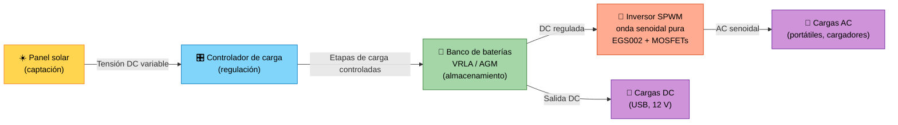

<div align="center">

# ☀️ S.O.S Solar
### Estación solar institucional de carga y respaldo energético

*Cuando la red falla, el sol responde.*


</div>

---

## 📖 Tabla de contenido

1. [¿Qué es S.O.S Solar?](#-qué-es-sos-solar)
2. [El problema que resolvemos](#-el-problema-que-resolvemos)
3. [¿Cómo funciona?](#-cómo-funciona)
4. [Logros del proyecto](#-logros-del-proyecto)
5. [Para curiosos y para expertos](#-para-curiosos-y-para-expertos)
6. [Desafío técnico: adaptarse sin comprometer la seguridad](#-desafío-técnico-adaptarse-sin-comprometer-la-seguridad)
7. [Evidencias y validación](#-evidencias-y-validación)
8. [Estructura del repositorio](#-estructura-del-repositorio)
9. [Equipo](#-equipo)
10. [Próximos pasos](#-próximos-pasos)
11. [Licencia](#-licencia)

---

## 🔆 ¿Qué es S.O.S Solar?

**S.O.S Solar** es una **estación solar institucional** que permite **cargar dispositivos electrónicos** (celulares, tablets, portátiles, radios) cuando hay **fallas en la red eléctrica** o durante una **emergencia**.

Captura la energía del sol, la almacena en baterías y la entrega de forma segura, sin depender de la red.

| | |
|---|---|
| 🎯 **Objetivo** | Dar a la comunidad educativa una alternativa de energía de respaldo, limpia y autónoma |
| 👥 **Usuarios** | Estudiantes, docentes, personal administrativo y de logística |
| 📍 **Entorno** | Institución educativa, Bogotá, Colombia |
| 🌱 **Diferencial** | Energía renovable, autonomía eléctrica completa y diseño adaptado al contexto local |

---

## 🚨 El problema que resolvemos

Las instituciones educativas suelen depender **por completo** de la red eléctrica. Cuando esta falla:

- 📵 Se pierde la comunicación (celulares sin batería).
- 💻 Se interrumpen actividades académicas y administrativas.
- ⚠️ No hay respaldo en una emergencia.
- 🌍 Tampoco existe un ejemplo visible de sostenibilidad en el campus.

**S.O.S Solar** responde a estas necesidades con un sistema propio, renovable y construido por estudiantes.

---

## ⚙️ ¿Cómo funciona?

El flujo de energía recorre cinco etapas:



### 💡 Una analogía para entenderlo

| Elemento del sistema | Se parece a... |
|---|---|
| ☀️ Panel solar | Un **techo que recoge agua de lluvia** |
| 🎛️ Controlador | La **llave de paso** que evita que el tanque se desborde |
| 🔋 Batería | El **tanque de almacenamiento** |
| 🔄 Inversor | Una **bomba y un filtro** que entregan el agua en la forma que cada aparato necesita |
| 📱 Dispositivos | Los **grifos** donde se usa el agua |

---

## 🏆 Logros del proyecto

- ✅ **Prototipo funcional** construido y operando.
- ✅ **Pruebas de carga exitosas** en distintas baterías, ajustando los controladores.
- ✅ **Esquemático y PCB** del inversor de onda senoidal pura (EGS002 / MOSFETs).
- ✅ **Sistema completo en marcha**: captación, regulación y almacenamiento.

---

## 🧭 Para curiosos y para expertos

Este repositorio habla con dos públicos. Abre el desplegable que más te interese.

<details>
<summary>🌱 <b>Glosario para novatos</b> (haz clic para abrir)</summary>

<br>

| Término | ¿Qué significa? |
|---|---|
| **Panel solar** | Placa que convierte la luz del sol en electricidad. |
| **DC (corriente continua)** | Electricidad que fluye siempre en el mismo sentido. La entregan paneles y baterías. |
| **AC (corriente alterna)** | Electricidad que cambia de sentido muchas veces por segundo. Es la de los tomacorrientes (en Colombia, 60 Hz). |
| **Controlador de carga** | El "cerebro cuidador": decide cuánta energía entra a la batería y cuándo, para no dañarla. |
| **Batería** | Guarda la energía para usarla de noche o cuando hay nubes. |
| **Inversor** | Convierte DC en AC para usar aparatos de tomacorriente. |
| **Onda senoidal pura** | Forma de onda "suave" idéntica a la de la red. Protege equipos sensibles. |
| **Autosuficiencia** | Capacidad de funcionar sin depender de la red eléctrica. |

</details>

<details>
<summary>📈 <b>Métricas y detalles técnicos para expertos</b> (haz clic para abrir)</summary>

<br>

| Parámetro | Detalle |
|---|---|
| Topología del inversor | Puente completo con modulación **SPWM** |
| Controlador del inversor | Módulo basado en **EGS002** |
| Etapa de potencia | **MOSFETs** |
| Forma de onda de salida | Senoidal pura, verificada con osciloscopio |
| Química de batería | VRLA / AGM (sustituyó a LiFePO4 por disponibilidad) |
| Gestión de batería | Límite de DoD + umbrales de carga ajustados |
| Análisis incluidos | Curvas de carga/descarga, eficiencia de conversión, rizado de tensión, autonomía con radiación de Bogotá |

📄 Detalle completo en **[`TECHNICAL_DOCS.md`](./TECHNICAL_DOCS.md)**.

</details>

<details>
<summary>🔌 <b>¿Qué dispositivos puedo cargar?</b></summary>

<br>

- 📱 Celulares y tablets
- 💻 Portátiles
- 📻 Radios y linternas recargables
- 🔋 Power banks

> Las potencias máximas dependen de la configuración final del banco de baterías y del inversor. Consulta el anexo técnico.

</details>

---

## 🛠️ Desafío técnico: adaptarse sin comprometer la seguridad

> **Problema:** el diseño contemplaba baterías **LiFePO4**, pero hubo **escasez y falta de stock** en el mercado local.

**Solución:** un banco alternativo **VRLA/AGM**, optimizado con **ingeniería de control**.

| Aspecto | Plan original | Solución implementada |
|---|---|---|
| Química | LiFePO4 | VRLA / AGM |
| Disponibilidad local | ❌ Baja | ✅ Alta |
| Cuidado de la vida útil | Gestión estándar | **Límite de profundidad de descarga (DoD)** |
| Carga | Umbrales de fábrica | **Ajuste fino de umbrales de carga** |
| Seguridad | Prioridad | Prioridad (se mantuvo) |

🎓 **Aprendizaje clave:** lograr alta eficiencia con los componentes que sí están disponibles, sin sacrificar la seguridad.

---

## 🔬 Evidencias y validación

| Verificación | ¿Qué demuestra? |
|---|---|
| 📏 Medición de tensión de entrada (Panel → Controlador) | El panel entrega la energía esperada |
| 🔋 Control de tensiones y etapas de carga hacia la batería | La batería se carga bien y dura más |
| 📺 Forma de onda del inversor en osciloscopio | La salida es senoidal pura y segura para equipos sensibles |
| 📱 Pruebas con dispositivos reales | El sistema funciona en condiciones de uso |

> 📸 Capturas, fotos y mediciones están en [`/media`](./media) y [`/docs`](./docs).

---

## 🗂️ Estructura del repositorio

Consulta el mapa completo en [`REPO_STRUCTURE.md`](./REPO_STRUCTURE.md).

```text
S.O.S-Solar/
├── README.md
├── TECHNICAL_DOCS.md
├── docs/
├── schematics/
├── pcb/
├── media/
└── ...
```

---

## 👥 Equipo

| Integrante | Rol |
|---|---|
| **Juan David Castañeda** | _Por definir_ |
| **Juan Arias** | _Por definir_ |
| **Juan José Torres** | _Por definir_ |

---

## 🚀 Próximos pasos

- [ ] Ampliar el banco de baterías según el uso real
- [ ] Agregar monitoreo de tensión y corriente
- [ ] Probar baterías LiFePO4 cuando haya disponibilidad
- [ ] Señalización educativa junto a la estación
- [ ] Taller de socialización con la comunidad educativa

---

## 📜 Licencia

Proyecto bajo licencia **MIT** (cámbiala si tu institución requiere otra). Ver [`LICENSE`](./LICENSE).

<div align="center">

**Hecho con ☀️ y curiosidad en Bogotá, Colombia**

</div>
