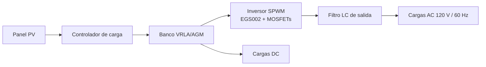
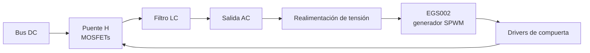

# 🔧 Anexo Técnico — S.O.S Solar

> Documento para público especializado. Para la visión general, ver [`README.md`](./README.md).
>
> ⚠️ **Convención:** los valores marcados como **`[REEMPLAZAR]`** son ejemplos o plantillas. Deben sustituirse por las mediciones y datasheets reales del prototipo antes de publicar. Los rangos típicos de baterías VRLA/AGM deben verificarse contra la hoja de datos del fabricante.

---

## Tabla de contenido

1. [Arquitectura del sistema](#1-arquitectura-del-sistema)
2. [Etapa de captación (panel solar)](#2-etapa-de-captación-panel-solar)
3. [Controlador y etapas de carga](#3-controlador-y-etapas-de-carga)
4. [Estrategia de gestión de la batería](#4-estrategia-de-gestión-de-la-batería)
5. [Inversor de onda senoidal pura (SPWM)](#5-inversor-de-onda-senoidal-pura-spwm)
6. [Esquemáticos y PCB](#6-esquemáticos-y-pcb)
7. [Cálculo de autonomía (Bogotá)](#7-cálculo-de-autonomía-bogotá)
8. [Eficiencia y rizado](#8-eficiencia-y-rizado)
9. [Protocolo de pruebas y validación](#9-protocolo-de-pruebas-y-validación)
10. [Limitaciones y trabajo futuro](#10-limitaciones-y-trabajo-futuro)

---

## 1. Arquitectura del sistema



| Bloque | Función | Referencia / Valor |
|---|---|---|
| Panel fotovoltaico | Captación | `[REEMPLAZAR: Wp, Voc, Isc, Vmp, Imp]` |
| Controlador de carga | Regulación y etapas de carga | `[REEMPLAZAR: modelo, tipo PWM/MPPT, corriente nominal]` |
| Banco de baterías | Almacenamiento | VRLA/AGM `[REEMPLAZAR: V, Ah, configuración serie/paralelo]` |
| Inversor | DC → AC senoidal | Módulo EGS002 + puente de MOSFETs |
| Cargas | Dispositivos | AC (tomacorriente) y DC (USB/12 V) |

---

## 2. Etapa de captación (panel solar)

Medición de tensión de entrada **Panel → Controlador**.

| Condición | Irradiancia aprox. | V_panel (V) | I_panel (A) | P (W) | Fecha / hora |
|---|---|---|---|---|---|
| Despejado | `[REEMPLAZAR]` | `[ ]` | `[ ]` | `[ ]` | `[ ]` |
| Parcialmente nublado | `[REEMPLAZAR]` | `[ ]` | `[ ]` | `[ ]` | `[ ]` |
| Nublado | `[REEMPLAZAR]` | `[ ]` | `[ ]` | `[ ]` | `[ ]` |

**Notas de montaje**

- Inclinación recomendada para Bogotá (latitud ≈ 4.6° N): ángulo bajo, del orden de 5°–15°, con la inclinación suficiente para autolimpieza por lluvia.
- Evitar sombras parciales en horas centrales.

---

## 3. Controlador y etapas de carga

Para baterías de plomo-ácido selladas, la carga se organiza típicamente en tres etapas:

| Etapa | Descripción | Variable controlada |
|---|---|---|
| **Bulk** | Carga a corriente máxima disponible | Corriente |
| **Absorción** | Tensión constante, la corriente decae | Tensión |
| **Flotación** | Mantenimiento a tensión menor | Tensión |

### Umbrales utilizados

Valores típicos de referencia para un banco de **12 V nominales** AGM/VRLA a 25 °C. **Verifica la hoja de datos de tu batería.**

| Parámetro | Típico (12 V) | Valor implementado |
|---|---|---|
| Tensión de absorción | 14.4 – 14.7 V | `[REEMPLAZAR]` |
| Tensión de flotación | 13.5 – 13.8 V | `[REEMPLAZAR]` |
| Corte por baja tensión (LVD) | ≈ 11.5 – 11.8 V bajo carga | `[REEMPLAZAR]` |
| Reconexión (LVR) | ≈ 12.4 – 12.6 V | `[REEMPLAZAR]` |
| Compensación por temperatura | ≈ −3 a −5 mV/°C/celda | `[REEMPLAZAR / no aplica]` |

> Para bancos de 24 V, multiplica por dos las tensiones.

### Registro de pruebas de carga

| Batería probada | Capacidad | Umbral abs. (V) | Umbral flot. (V) | Resultado |
|---|---|---|---|---|
| `[REEMPLAZAR]` | `[ ]` | `[ ]` | `[ ]` | `[ ]` |

---

## 4. Estrategia de gestión de la batería

### 4.1 Por qué VRLA/AGM

El diseño original contemplaba **LiFePO4**. Por escasez de stock local se adoptó un banco **VRLA/AGM**.

| Característica | LiFePO4 | VRLA / AGM | Implicación de diseño |
|---|---|---|---|
| DoD recomendado | Alto (80–90 %) | Moderado (≈ 50 %) | Limitar descarga |
| Ciclos de vida | Altos | Menores y muy sensibles al DoD | Proteger con LVD |
| Sensibilidad a sobrecarga | Requiere BMS | Sensible a gaseo y sulfatación | Ajustar umbrales |
| Disponibilidad local | Baja | Alta | Justifica el cambio |

### 4.2 Medidas de control implementadas

1. **Límite de DoD:** corte por baja tensión (LVD) para no descargar más de lo planificado.
2. **Umbrales de carga ajustados:** absorción y flotación calibradas al fabricante.
3. **Reconexión con histéresis:** evita oscilaciones de conexión/desconexión.
4. **Dimensionamiento:** capacidad suficiente para que la descarga diaria típica quede dentro del DoD objetivo.

### 4.3 Capacidad útil

```text
E_util (Wh) = V_banco × C_Ah × DoD_max
```

---

## 5. Inversor de onda senoidal pura (SPWM)

### 5.1 Principio

El inversor genera una señal **SPWM**: un tren de pulsos cuyo ancho varía siguiendo una senoidal de referencia de 60 Hz. Un filtro **LC** pasa-bajos elimina la portadora y deja la senoidal.



### 5.2 Especificaciones

| Parámetro | Valor |
|---|---|
| Topología | Puente completo (H-bridge) |
| Modulación | SPWM (unipolar o bipolar según configuración) |
| Módulo de control | EGS002 `[REEMPLAZAR: confirmar variante y versión]` |
| Frecuencia de salida | 60 Hz (configurada para Colombia) |
| Tensión de salida nominal | 120 V RMS `[REEMPLAZAR si difiere]` |
| Potencia nominal | `[REEMPLAZAR: W]` |
| Tensión de entrada DC | `[REEMPLAZAR: V]` |
| MOSFETs de potencia | `[REEMPLAZAR: referencia, Vds, Rds(on), Id]` |
| Frecuencia de conmutación | `[REEMPLAZAR: kHz]` |
| Tiempo muerto | `[REEMPLAZAR: µs]` |
| Etapa de elevación | `[REEMPLAZAR: transformador de baja frecuencia o convertidor DC-DC elevador]` |
| Protecciones | `[REEMPLAZAR: sobrecorriente, sobretemperatura, baja tensión, etc.]` |
| THD de salida | `[REEMPLAZAR: % medido]` |

### 5.3 Consideraciones de diseño

- **Tiempo muerto:** evita la conducción simultánea de los MOSFETs del mismo brazo.
- **Disipación:** calcular pérdidas por conducción (`I²·Rds(on)`) y por conmutación.
- **Filtro LC:** dimensionar la frecuencia de corte muy por debajo de la de conmutación y muy por encima de 60 Hz.
- **Cargas sensibles:** la onda senoidal limpia reduce calentamiento y ruido en cargadores y fuentes conmutadas.

---

## 6. Esquemáticos y PCB

| Archivo | Descripción | Ubicación |
|---|---|---|
| Esquemático del inversor | Etapa de control y potencia | `schematics/inverter/` |
| PCB del inversor | Diseño y gerbers | `pcb/inverter/` |
| Esquemático de potencia / DC | Conexiones del sistema | `schematics/system/` |

**Vista previa (reemplazar por tus imágenes):**

```markdown


```

**Buenas prácticas de PCB aplicadas / recomendadas**

- Pistas de potencia anchas y cortas.
- Plano de tierra continuo; separar tierra de potencia y de señal con unión en un punto.
- Condensadores de desacople próximos a los MOSFETs.
- Lazo de compuerta lo más corto posible.

---

## 7. Cálculo de autonomía (Bogotá)

### 7.1 Datos de radiación

Bogotá presenta una **radiación moderada y poco estacional** por su latitud ecuatorial. Como referencia de diseño usa **horas sol pico (HSP)** entre **3.5 y 4.5 h/día**. Para un dato oficial, consulta el Atlas de Radiación Solar del IDEAM/UPME o la herramienta Global Solar Atlas, y registra aquí la fuente.

### 7.2 Fórmulas

```text
Energía diaria generada:
E_gen (Wh/día) = P_panel (Wp) × HSP (h) × PR

Energía útil almacenada:
E_util (Wh) = V_banco × C_Ah × DoD_max

Autonomía (horas):
t_aut (h) = (E_util × η_inv) / P_carga (W)
```

Donde `PR` (performance ratio) agrupa pérdidas de cableado, temperatura, controlador y suciedad (típico 0.65–0.80) y `η_inv` es la eficiencia del inversor.

### 7.3 Ejemplo ilustrativo (reemplazar con tus datos)

| Variable | Valor de ejemplo |
|---|---|
| P_panel | 100 Wp |
| HSP (Bogotá, conservador) | 4.0 h |
| PR | 0.70 |
| V_banco | 12 V |
| C | 100 Ah |
| DoD_max | 50 % |
| η_inv | 0.85 |

```text
E_gen  = 100 × 4.0 × 0.70     = 280 Wh/día
E_util = 12 × 100 × 0.50      = 600 Wh
E_AC   = 600 × 0.85           = 510 Wh

Carga de 10 W (cargando un celular)  → 510 / 10  = 51 h
Carga de 60 W (portátil)             → 510 / 60  = 8.5 h
Recarga completa del banco útil      → 600 / 280 ≈ 2.1 días de sol
```

### 7.4 Tabla para el prototipo real

| Escenario | Carga (W) | Autonomía (h) | Días de recarga |
|---|---|---|---|
| Carga ligera | `[ ]` | `[ ]` | `[ ]` |
| Carga media | `[ ]` | `[ ]` | `[ ]` |
| Carga máxima | `[ ]` | `[ ]` | `[ ]` |

---

## 8. Eficiencia y rizado

### 8.1 Eficiencia de conversión

```text
η_total = η_controlador × η_batería × η_inversor
η_inversor = P_AC_salida / P_DC_entrada
```

| Punto de carga | P_DC (W) | P_AC (W) | η_inversor (%) |
|---|---|---|---|
| 25 % | `[ ]` | `[ ]` | `[ ]` |
| 50 % | `[ ]` | `[ ]` | `[ ]` |
| 100 % | `[ ]` | `[ ]` | `[ ]` |

### 8.2 Rizado de tensión

| Punto de medición | Rizado pico a pico (mV) | Condición |
|---|---|---|
| Bus DC de entrada al inversor | `[ ]` | `[ ]` |
| Salida de batería | `[ ]` | `[ ]` |
| Salida DC (USB / 12 V) | `[ ]` | `[ ]` |

---

## 9. Protocolo de pruebas y validación

| # | Prueba | Instrumento | Criterio de aceptación | Estado |
|---|---|---|---|---|
| 1 | Tensión de entrada Panel → Controlador | Multímetro | Dentro del rango del panel | ☐ |
| 2 | Etapas de carga hacia la batería | Multímetro / registro | Umbrales respetados | ☐ |
| 3 | Forma de onda de salida | Osciloscopio | Senoidal limpia, 60 Hz | ☐ |
| 4 | Tensión RMS de salida | Multímetro True RMS | ≈ 120 V dentro de tolerancia | ☐ |
| 5 | Carga de dispositivos reales | Dispositivos | Cargan sin fallas | ☐ |
| 6 | Corte por baja tensión (LVD) | Fuente / carga | Desconecta en el umbral | ☐ |
| 7 | Prueba de carga en distintas baterías | Banco de pruebas | Carga correcta | ☐ |

> ⚡ **Seguridad:** la salida del inversor es tensión de red. Mide siempre con sondas adecuadas, aislamiento correcto y con supervisión docente.

---

## 10. Limitaciones y trabajo futuro

- El banco VRLA/AGM exige límite de DoD más estricto que LiFePO4.
- La autonomía depende de la radiación diaria; en períodos lluviosos prolongados la recarga se reduce.
- Mejoras previstas: monitoreo remoto, corrección por temperatura de la carga, migración a LiFePO4 con BMS cuando haya disponibilidad.

---

## Referencias sugeridas

- Hojas de datos: EGS002, MOSFETs utilizados, controlador de carga y baterías.
- Atlas de Radiación Solar de Colombia (IDEAM / UPME).
- Global Solar Atlas (Banco Mundial / Solargis).
